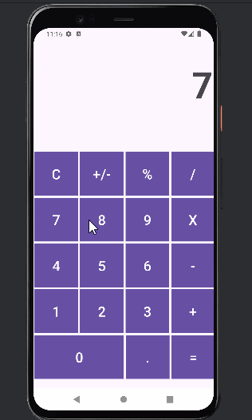

# Project Name
Calculator App:

This is a calculator app, built in Android, that can carry out simple arithmetic operations. It is a user-friendly interface that helps provide users with accurate and real-time calculations. 
## Functionality
The following **required** functionality is completed:
* [ ] User sees keypad with numbers with 0-9 as well as a button for an integer sign (+/-), equal sign, decimal point, and arithmetic processes (+, -, %, *, /)
* [ ] User can calculate arithmetic operations using integers as well as decimal numbers. 
* [ ] User can do cumulative calculations using the result of a subsequent calculation without resetting.
* [ ] User can use the clear button to reset and refresh app as many times as needed.
* [ ] User can see updated results in the display as buttons are clicked.  
The following **extensions** are implemented:
* User can see appropriate results for invalid results (extremely large/small values or division by 0)
* User can see a default screen with a value of zero, rather than a blank screen upon entering app. 
## Video Walkthrough
Here's a walkthrough of implemented user stories:

GIF created with [LiceCap](http://www.cockos.com/licecap/).
## Notes
Describe any challenges encountered while building the app.
  It was very difficult to find an algorithm for switching between operations while also doing cumulative calculations without pressing the equal button to separate them. 
  I wasn't able to figure out how to store/update the right value in order to continue the sequence when different operators were used because the counter I was using was specific to the operator and was reset when a different operator was needed for consistency.
  In the future, I might be able to replicate a similar project, in which the layout is slightly different such that the counters for each operation is unique and won't conflict with another operation if performed in subsequent patterns.
## License
Copyright [2024] [Trisha Yerragudi]
Licensed under the Apache License, Version 2.0 (the "License");
you may not use this file except in compliance with the License.
You may obtain a copy of the License at
http://www.apache.org/licenses/LICENSE-2.0
Unless required by applicable law or agreed to in writing, software
distributed under the License is distributed on an "AS IS" BASIS,
WITHOUT WARRANTIES OR CONDITIONS OF ANY KIND, either express or implied.
See the License for the specific language governing permissions and
limitations under the License.
